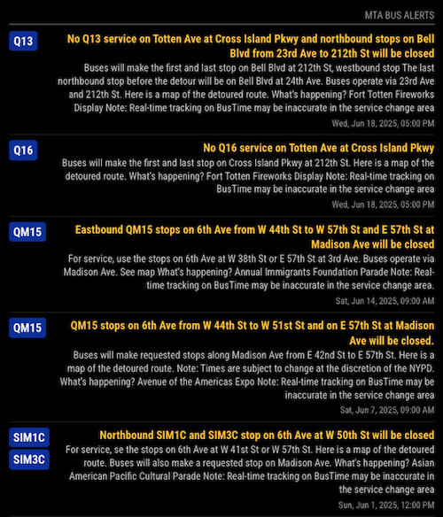

# MMM-MTA-BusAlerts

**MMM-MTA-BusAlerts** is a module for [MagicMirror²](mm) that displays real-time service alerts for the New York City MTA Bus system. It includes the ability to filter alerts by specific bus route numbers.



This module utilizes the [MTA's Realtime Data Feeds](https://api.mta.info/), specifically the[Bus Alerts API](https://api.mta.info/#/serviceAlerts).

Please refer to the [MTA Terms and Conditions](https://www.mta.info/developers/terms-and-conditions) for API usage.

## Installation

### Install

To install MMM-MTA-BusAlerts, navigate to your [MagicMirror²][mm] module folder in your terminal and clone the repository:

```bash
cd ~/MagicMirror/modules
git clone https://github.com/avianto/MMM-MTA-BusAlerts
```
Then, install the dependencies:

```bash
npm install
```

### Update

To update the module, go to the module's directory and run the following commands:

```bash
cd ~/MagicMirror/modules/MMM-MTA-BusAlerts
git pull
npm install
```

## Using the module

To use this module, add it to the `modules` array in the `config/config.js` file.

A basic configuration to display the latest 10 alerts for all bus lines:

```js
    {
        module: 'MMM-MTA-BusAlerts',
        position: 'top_left'
    },
```
For more control, you can use all available options:

```js
    {
        module: 'MMM-MTA-BusAlerts',
        position: 'top_left',
        config: {
            updateInterval: 5 * 60 * 1000,
            busRoutes: [],      //Array of bus routes to filter (e.g., ["M15", "M34"]). 
                                // An empty array shows all alerts.
            maxAlerts: 10,
            showRouteNumber: true,
            showTimestamp: true,
            animationSpeed: 1000,
            header: "MTA Bus Alerts",
            hideGeneralAlerts: false,
            generalThresholdRoutes: 20,        
        }
    },
```

## Configuration options

Option|Type|Default|Description
------|------|------|-----------
`updateInterval`|`number`| `300000` (5 minutes) |How often the module updates (in milliseconds).
`busRoutes`|`array` of `string`s| `[]`|Array of bus routes to filter (e.g., `["M15", "M34"]`). Empty means show all alerts.
`maxAlerts`|`number`|`10`|Maximum number of alerts to display.
`showRouteNumber`|`boolean`|`true`|Show the bus route number as a badge.
`showTimestamp`|`boolean`|`true`|Show the alert's start time.
`animationSpeed`|`number`|`1000`|Speed of DOM updates (in milliseconds).
`header`|`string`|`"MTA Bus Alerts"`|Module header text.
`hideGeneralAlerts`|`boolean`|`false`|Set to true to hide system-wide alerts.
`generalThresholdRoutes`|`number`|`20`|If an alert affects more than this many routes, consider it "System Wide".


[mm]: https://github.com/MagicMirrorOrg/MagicMirror
